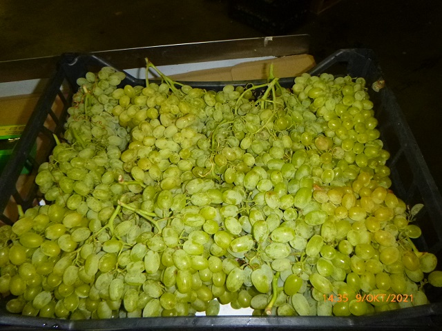

# Инструкция по работе с Markdown

## Выделение текста

//Самый большой заголовок, один знак решётка (#)   
Например:

# Заголовок 1 уровня

// Второй способ заголовка первого уровня, ставим знак равно под текстом (=)   
Например:

Второй способ заголовка первого уровня
=

//Для вывода заголовка второго уровня ставим два знака решётки (##)   
Пример
## Заголовок второго уровня

//Второй способ заголовка 2 уровня, ставит тире под текстом (-)  
Пример: 

Заголовок второго уровня
-

Заголовки более низкого уровня выполняются с увеличением знаков решётки (###)
Пример:
### Третий уровень

и так далее

//Чтобы выделить текст жирным ставим два знака звёздочки с двух сторон текста (**) или нижнее подчёркивание дважды с двух сторон текста (__)

Пример  
__Жирный__

**И это жирный**

//Чтобы выделить текст курсивом ставим  знак звёздочка (*) или нижнее подчёркивание (_)

Пример:

*Курсив*

_Курсив второй способ_

//Чтобы текст стал зачёрнкнутым  ставим с двух сторон два знака тильды(~)

~~Зачёркнутый текст~~

//Можно применить для одного текста несколько выделений, для этого курсив и жирный имеет два вида исполнения

Пример

*__Жирный курсив__ или часть текста курсивом*

    // Можно выделить текст мышкой или shift + стрелки и нажать  звёздочку , то с двух строн звёздочки сами поставяться и *текст станет курсивом*, нажав два раза звёздочку **текст станет жирным**, три раза звёздочка - ***жирный курсив*** (личное наблюдение). А нажав TAB перед текстом, будет фон.

___
## Списки

//Добавим немаркированный список, с помощью знака плюс (+)

+ Первый элемент
+ Второй элимент
+ Третий элимент

//или так, с помощью знака звёздочка (*)

* Первый элемент
* Второй элемент

//или так, с помощью знака минус (-)

- 1 элемент
- 2 элемент

// Добавляем нумерованный список, просто нуммируб цифрами, 1.,2.,3.

1. Первый элемент
2. Второй элемент

// Подпункты, для этого нажимаем TAB и по аналогии с обычным списком

1. Первй элемент, //нажимаем TAB
    1.1 Подэлемент 1 //Нажимает TAB
    1.2 Подэлемент 2

2. Второй элемент  //TAB  
    2.1 Подэлемент 1 // TAB
    2.2 Подэлемент 2

## Работа с изображениями

//Добавить изображение с удалённого сервера, с помощью 

Пример:

//Добавить картинку с локальной папки, аналогично, только в скобках указываем путь к изображению, если изображение лежит в тойже папке, что и файл, то просто пишем название изображения

Пример:
 текс в кавычках, показывает описание картинки при наведении мышкой

// Можно добавить gif анимацию

## Ссылки

// Чтобы добавать ссылку, вставляем её между двумя знаками <>

Просто ссылка <https://vk.com/dmitriy_losev>

//Для красоты, можно  ссылку спрятать в название, в этом случае имя ссылки в квадратных скобках [], а следом в скабках ссылку

Пример:
Мой профиль [Вконтакте](https://vk.com/dmitriy_losev)

//Можно добавить описание к сылке при наведении на неё мышкой, к ссылке в скобках добавить описание в двойных или одинарных кавычках

Пример:

[Вконтакте](https://vk.com/dmitriy_losev "Мой профиль")

// Добавляем ссылку на документ, в квадратных скобках название документа, в круглых путь к документу, если лежит в этой же папке, что и файл, то просто имя документа с расширением.

Пример:

 **[Презентация лекции](lection.pdf)** (*для открытия возможно потребуется расширение в программе для открытия pdf*)

// Аналогично добавляем ссылку на докумен с удалённого ресурса

Пример:

 [Презентация лекции](https://gbcdn.mrgcdn.ru/uploads/asset/3382251/attachment/b5c88675c477bd530bd5b532a181cf2f.pdf)

## Цитаты

// Чтобы вставить в текст цитату в начале текста ставим значок больше (>), если после первой цитаты поставить 2 значка больше, то получиться вложенная цитата. 

Пример:

> Так обозначают цитату
>> Вложенная цитатата

//Обычно цитаты выделят цветом это можно также выделить кнопкой TAB

    Цитата

## Работа с таблицами

// Полной информации я не нашёл как работать с таблицами, надеюсь покажут на семинаре.

Получилось что то такое:

|Название | на языке Markdown|
-----|------
Заголовки | #
Списки |*, -, +
Нумерованный списки | 1. 2. 3., Подпункты с помощью TAB
Разделительная линия | ***
Выделение текста |**Жирный**, *курсив*, ~~зачеркнутый~~
Цитаты|>
Картинки| 
Ссылки|[текст](прямая ссылка)
Возможность использовать HTML| есть

## Заключение

В Markdown   можно встроить HTML

Например изменить цвет текста